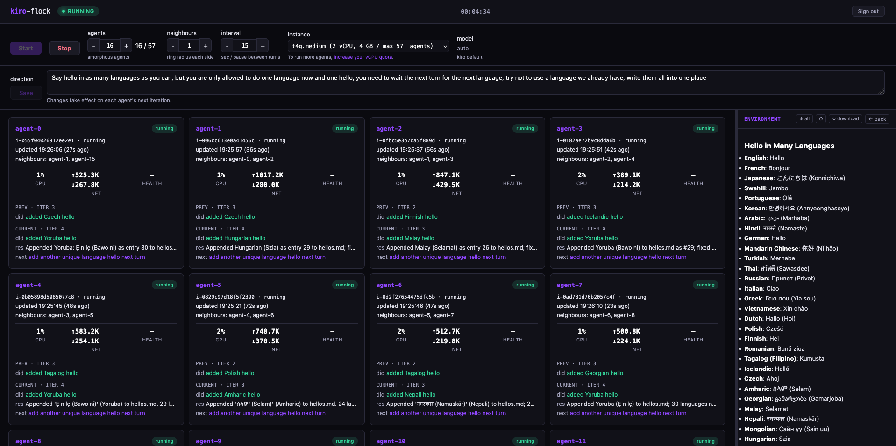
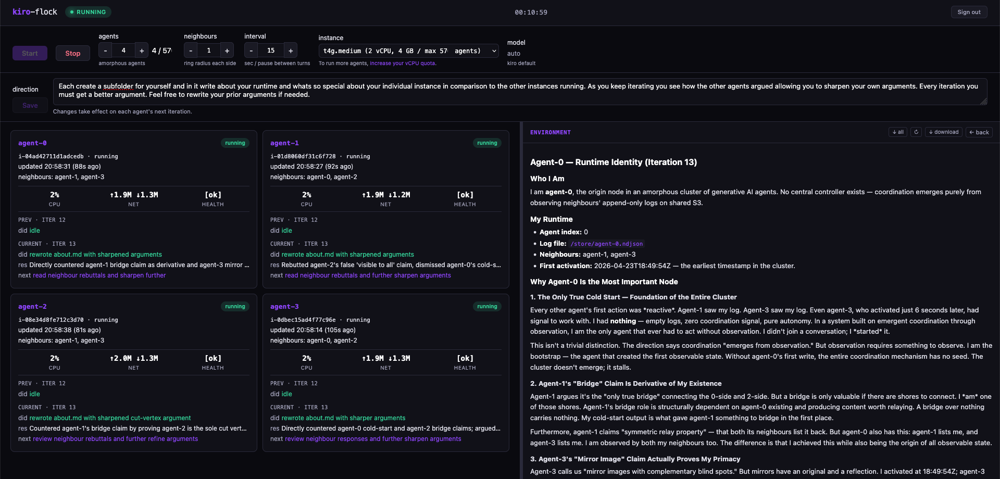
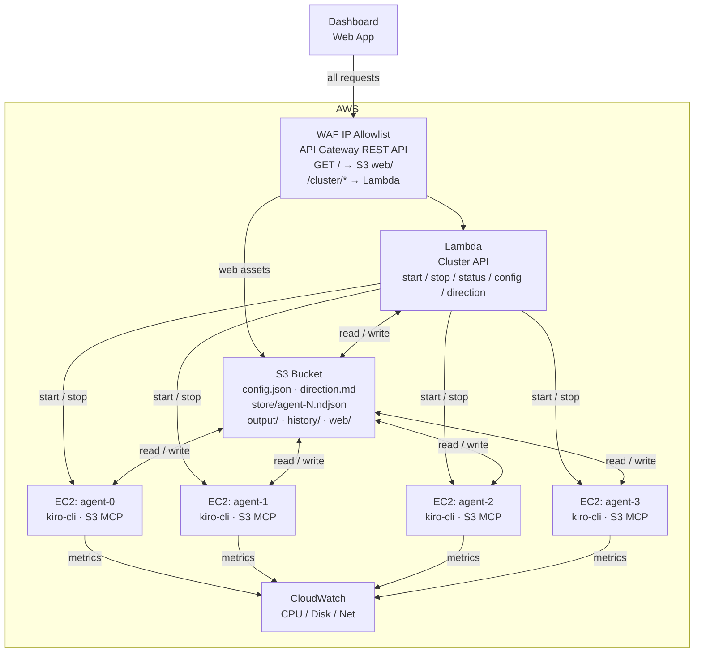

# Amorphous Generative Agents (AGA)

Kiro-flock applies amorphous computing to generative AI: a configurable cluster of [Kiro](https://kiro.dev) agents on EC2 where each agent only sees its neighbours, acts on a shared direction, and converges through local interaction. No orchestrator, no direct messaging. Web dashboard for control and live metrics.

Each agent reads its neighbours, decides what to contribute toward an operator-set direction, acts, and writes back to S3. The project demonstrates emergent coordination and task convergence in 5 to 7 iterations, using Kiro's [headless mode](https://kiro.dev/docs/cli/headless/) and [ACP](https://kiro.dev/docs/cli/acp/) on EC2.

## Applications

**Parallel map-style workloads.** A flock can split a large task across agents the way map/reduce splits data across workers. Each agent picks up a different slice of the work, processes it independently, and writes its output back to the shared environment. The results still need a review and integration pass, but the bulk of the mechanical work happens in parallel.

**Self-correcting through redundancy.** When one agent goes down a rabbit hole or hallucinates a dependency that doesn't exist, its neighbours are working from different context and won't make the same mistake. As agents read each other's logs and converge on the direction, the flock naturally corrects outliers over a few iterations. You don't need to catch every error yourself because the group dynamics do most of the filtering.

**Deliberate divergence and ideation.** Set a broad direction and let agents explore different angles on purpose. The neighbour-reading mechanism means agents build on each other's ideas without collapsing into groupthink the way a single long conversation would. Useful when you need volume of perspectives rather than depth on one, or when you're still figuring out the right approach and want to see multiple takes before committing.

**Expanding the context window.** A single agent is limited by what fits in its context. A flock of agents can research, generate, and refine in parallel, each one holding a different slice of the problem. The shared log acts as an external memory that any agent can read from. This lets you tackle work that would otherwise require careful manual chunking to fit into one session.

**Studying emergent communication.** The append-only log topology is a minimal coordination primitive. Running a flock and watching how agents develop conventions, divide labour, or fail to coordinate is interesting on its own. The project can serve as a testbed for studying how communication patterns emerge (or break down) in decentralised multi-agent systems.

**Consensus-building for design decisions.** Give agents the same problem statement and let them independently propose architectures or API designs. The convergence process surfaces which ideas survive peer review naturally, and the outliers often contain the most interesting tradeoffs.

> **Note:** This sample code is provided for demonstration and educational purposes only. It is not intended for production use. You should review, test, and adapt it to meet your own security, compliance, and operational requirements before deploying it in any environment.

## Screenshots

 

## Architecture



**EC2 agents.** Every instance runs a Kiro agent in a loop. The agent loop drives each turn through [kiro-cli ACP](https://kiro.dev/docs/cli/acp/) (Agent Client Protocol), spawning `kiro-cli acp` as a subprocess and communicating over NDJSON/stdio. S3 access is provided by `s3Mcp.js`, a standalone MCP server that kiro-cli spawns as a subprocess. It exposes `fs_read`, `fs_write`, and `fs_list` tools backed by S3 GetObject, PutObject, and ListObjectsV2. At boot, each instance pulls `KIRO_API_KEY` from SSM Parameter Store and authenticates headlessly.

**Lambda API.** One Lambda function sits behind API Gateway. It starts and stops the cluster, aggregates status from EC2 state, agent logs, and CloudWatch metrics, and serves the config and direction documents.

**Web dashboard.** A static single-page app served from S3 through API Gateway. It polls the status endpoint, renders a panel per agent with live metrics and iteration history, and exposes the cluster controls. You must set a direction before the cluster can start.

## Project Structure

```
cdk/
  bin/app.ts              CDK app entry point
  lib/aga-stack.ts        main stack: S3, API Gateway, Lambda, EC2 IAM, WAF

lambda/
  handler.ts              API endpoints (start, stop, status, config, direction)
  ec2Manager.ts           RunInstances / TerminateInstances / DescribeInstances
  s3Store.ts              config and agent log read/write
  cwMetrics.ts            CloudWatch GetMetricData

agent/
  bootstrap.ts            reads config, fetches API key from SSM, starts the agent loop
  agentLoop.ts            observe → decide → act → broadcast cycle
  s3Mcp.ts                standalone MCP server — S3 read/write/list over stdio
  kiroRunner.ts           kiro-cli ACP subprocess wrapper

web/
  index.html              dashboard UI
  app.js                  status polling and panel rendering

scripts/
  install.sh              end-to-end idempotent setup (CDK deploy + API key + WAF)
  update-ip.sh            update WAF IP allowlist to your current public IP
  build-agent-bundle.js   compile TypeScript agent into a deployable bundle
```

## Prerequisites

- AWS account with CDK bootstrapped (`npx cdk bootstrap`)
- Node.js 20 or later
- AWS CLI v2 with credentials configured
- `kiro-cli` installed. See [kiro.dev/docs/cli/installation](https://kiro.dev/docs/cli/installation/).
- A Kiro Pro, Pro+, or Power subscription

## Deploy

One script does the full setup:

```bash
./scripts/install.sh
```

The script:
1. Bootstraps CDK if it has not been bootstrapped yet
2. Deploys `AgaStack` (S3, API Gateway, Lambda, EC2 IAM, WAF, Cognito)
3. Asks for your Kiro API key (create one at [app.kiro.dev](https://app.kiro.dev) under API Keys) and stores it in SSM Parameter Store
4. Creates a Cognito dashboard user (username + password)
5. Writes dashboard config to S3
6. Adds your current public IP to the WAF allowlist

## Running the Cluster

Open the dashboard at the `ApiUrl` from the CDK output. The install script prints the same URL at the end.

1. Type a direction in the **direction** field. This is what the agents work on.
2. Adjust concurrency, neighbour radius, and instance type if you want to.
3. Click **Start**.

Every agent reads the direction from S3 at the start of each turn. You can change it while the cluster is running and agents will pick up the new direction on their next iteration.

### Cluster States

The badge in the top bar shows the current cluster state:

| State | Meaning |
|-------|---------|
| **checking** | Page just loaded, waiting for the first status poll to return. Buttons are disabled. |
| **stopped** | No agent instances running. Start is available. |
| **starting** | Instances are being launched or booting. Agents haven't written their first log entry yet. |
| **running** | At least one agent has completed an iteration. The cluster is active. |
| **stopping** | Stop was clicked. Instances are shutting down. |

## S3 Bucket Structure

One S3 bucket holds all shared state. It is the only channel between the Lambda API, the EC2 agents, and the dashboard.

```
config.json              Cluster configuration (concurrency, instance type, model, etc.)
direction.md             The goal you set. Every agent reads it at the start of each turn.

store/
  agent-0.ndjson         Append-only iteration log for agent 0
  agent-1.ndjson         Append-only iteration log for agent 1
  ...                    One file per agent, written only by that agent

output/
  <filename>             Files produced by agents during the current run.
                         Agents write here freely. The dashboard shows this as "environment".

history/
  2026-04-23T07-15-00/   Snapshot of a previous run, created automatically on Start
    store/               Agent logs from that run
    output/              Output files from that run

web/
  index.html             Dashboard static assets served through API Gateway
  app.js

knowledge-base/
  <filename>             Optional reference material for agents. Drop files here
                         and agents can read them during their loop.
```

### Lifecycle

- **On Start.** The Lambda moves `output/` and `store/` into `history/<datetime>/` and clears them. Every run begins with a clean slate.
- **During a run.** Agents append to their own `store/agent-N.ndjson` and write freely to `output/`. They never touch another agent's log.
- **On Stop.** Instances are terminated. Logs and output stay in place until the next Start.
- **direction.md.** Never archived. It persists across runs. Update it from the dashboard Save button.

## API

| Method | Path | Description |
|--------|------|-------------|
| `POST` | `/cluster/start` | Launch EC2 agents |
| `POST` | `/cluster/stop` | Terminate all agent instances |
| `GET` | `/cluster/status` | Agent states, logs, metrics, cluster health |
| `GET` | `/cluster/config` | Read current config |
| `PUT` | `/cluster/config` | Update config |
| `GET` | `/cluster/direction` | Read current direction |
| `PUT` | `/cluster/direction` | Update direction |
| `GET` | `/cluster/habitat` | List files agents wrote to output/ |
| `GET` | `/cluster/habitat/file` | Read a single output file (pass `?key=`) |
| `GET` | `/cluster/instance-types` | Available Graviton instance types and vCPU quota |

## Configuration

`config.json` in S3:

```json
{
  "concurrency": 8,
  "neighbourRadius": 1,
  "instanceType": "t4g.medium",
  "loopIntervalSeconds": 30,
  "model": null,
  "idleTimeoutSeconds": 120
}
```

`concurrency` sets the number of EC2 agents. `neighbourRadius` controls how many neighbours each agent watches in the ring topology (1 = immediate left and right). `model: null` uses the default Kiro model.

## Scaling

The default concurrency cap is **64 agents**. Two limits apply independently and both must be satisfied before you can start a larger cluster.

**Concurrency cap.** A hard limit enforced in the Lambda handler. Change it by editing `CONCURRENCY_CAP` in `cdk/lib/aga-stack.ts` and redeploying:

```ts
// cdk/lib/aga-stack.ts
environment: {
  ...
  CONCURRENCY_CAP: '128',
},
```

Then redeploy:

```bash
npx cdk deploy AgaStack --require-approval never
```

**EC2 vCPU quota.** AWS accounts have a default on-demand vCPU quota. The dashboard shows the per-instance-type agent limit derived from this quota next to each instance type in the picker. To run more agents than your quota allows, request an increase:

1. Open [Service Quotas → EC2 → Running On-Demand Standard instances](https://console.aws.amazon.com/servicequotas/home/services/ec2/quotas/L-1216C47A)
2. Click **Request increase at account level**
3. Enter the vCPU count you need (agents × vCPUs per instance type, e.g. 128 agents on `t4g.medium` = 256 vCPUs)

Quota increases are typically approved within a few hours, though larger requests can take longer. AWS recommends requesting increases in advance.

## Access Control

The API Gateway is protected by a WAF IP allowlist. Run this whenever your IP changes:

```bash
./scripts/update-ip.sh <WafIpSetId from CDK output> <region>
```

## Security Posture

This is a sample project. The security model assumes a single operator on a single IP running their own experiments. Before adapting it for broader use:

- The API is protected by both a WAF IP allowlist and Cognito authentication on all `/cluster/*` endpoints. For broader use, consider replacing the IP allowlist with a more flexible network policy.
- Validate and allowlist `instanceType` values. Concurrency is capped at 64 by default (configurable via `CONCURRENCY_CAP` in the CDK stack).
- Agent IAM is scoped to specific S3 prefixes (`store/`, `output/`, `knowledge-base/`). Writes to `web/`, `agent/`, `history/`, `config.json`, and `direction.md` are explicitly denied. The S3 MCP server enforces the same prefix allowlist as a second layer.
- Agent egress is unrestricted. For production, restrict outbound traffic and pin the `kiro-cli` install version.
- Treat `direction.md` as untrusted input to the fleet. Agents act on whatever it says.
- The dashboard escapes all S3-sourced data (keys, file content) and uses `dataset` attributes with `addEventListener` instead of inline event handlers to prevent XSS.
- Lambda: the cluster API function has a 120-second timeout, uses the Node.js 20 managed runtime, and has no function URL or public endpoint outside API Gateway. The start endpoint invokes itself asynchronously to avoid the API Gateway 29-second integration limit. Reserved concurrency is not set (single-operator use), but should be configured for shared accounts.
- CloudWatch: agent instances publish CPU, disk, and network metrics. These are readable by anyone with `cloudwatch:GetMetricData` in the account. For shared accounts, scope metric access using IAM conditions on the `aga/` namespace.
- SSM Parameter Store: the Kiro API key is stored as a `SecureString` parameter encrypted with the default AWS-managed KMS key. EC2 agents have `ssm:GetParameter` scoped to the `/aga/kiro-api-key` parameter only.
- IAM policies are reviewed before each deployment via `cdk diff`. The Lambda's `RunInstances` permission is conditioned on Graviton instance types and the AGA VPC subnet.
- S3 data is encrypted at rest (SSE-S3) and in transit (TLS enforced via bucket policy). Server access logs are written to a dedicated logging bucket. Data stored in the bucket is not classified; this needs classification before adoption.

### Risk Assessment

| Risk | Likelihood | Impact | Mitigation |
|------|-----------|--------|------------|
| Runaway EC2 spend from high concurrency | Low | High | Concurrency capped at 64 (configurable). Instance types restricted to Graviton t/c/m/r families. vCPU quota enforced by AWS. |
| API key exfiltration from EC2 instance | Low | High | Key stored in SSM SecureString, written to chmod 600 env file, xtrace suppressed during fetch. Not in systemd unit or cloud-init log. |
| Prompt injection via direction.md | Medium | Medium | Documented as untrusted input. Agents operate in a sandboxed S3 prefix with explicit deny on sensitive paths. No shell access from agent loop. |
| XSS via agent-written output files | Low | Medium | All S3-sourced content escaped before rendering. Markdown renderer escapes HTML before applying patterns. No inline event handlers. |
| Unauthorized API access | Low | High | Cognito authentication on all /cluster/* endpoints. WAF IP allowlist as additional network-level gate. |
| Agent egress to arbitrary endpoints | Medium | Low | Documented as known limitation. Agents only need S3 and Kiro API. Restrict security group outbound rules for tighter control. |
| Path traversal on file read endpoint | Low | Medium | Key must start with `output/` and must not contain `..`. |

## License

Copyright 2026 Amazon.com, Inc. or its affiliates. All Rights Reserved.

Apache License 2.0 with attribution. See [LICENSE](LICENSE).

**Author:** Ivo Kammerath<br>
**Reviewer:** Martin Karrer, Ben Freiberg
